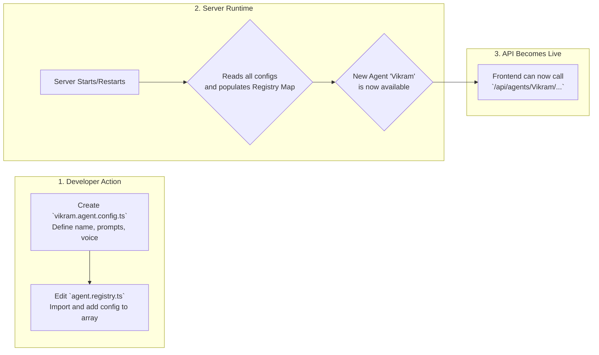

# Backend Server Documentation

This directory contains the Node.js/Express backend for the AI Agent application. It serves as the "brain" of the system, handling all AI logic, prompt management, and secure communication with the Google Gemini API.

---

## 🏛️ Layered Architecture

The server is built using a clean, layered architecture to separate concerns and improve maintainability. This design ensures that the code is organized, scalable, and easy to understand.

```mermaid
graph TD
    subgraph "Browser"
        Frontend[React UI]
    end

    subgraph "Backend Server (Node.js/Express)"
        direction TB
        L1[<b>Presentation Layer</b><br/>(Routes & Controllers)]
        L2[<b>Service Layer</b><br/>(Business Logic)]
        L3[<b>Configuration Layer</b><br/>(Agent Registry & Prompts)]
        L4[<b>External API Client</b><br/>(GoogleGenAI SDK)]

        L1 -- Calls --> L2
        L2 -- Uses --> L3
        L2 -- Uses --> L4
    end

    subgraph "Google Cloud"
        Gemini[Gemini API]
    end

    Frontend -- HTTP Request --> L1
    L4 -- API Call --> Gemini
    Gemini -- API Response --> L4
```

### How the Layers Work

1.  **Presentation Layer (`routes.ts`, `*.controller.ts`)**:
    *   **Responsibility**: This is the entry point for all incoming API requests. It handles HTTP-specific tasks like parsing request bodies, validating parameters, and sending back formatted JSON responses.
    *   **Function**: It receives the request, extracts necessary data (like the agent's name from the URL), and calls the appropriate function in the Service Layer. It does **not** contain any business logic.

2.  **Service Layer (`*.service.ts`)**:
    *   **Responsibility**: This layer contains the core business logic of the application. It orchestrates the process of generating an AI response.
    *   **Function**: It receives data from the Presentation Layer, uses the Configuration Layer to fetch the correct prompts for the requested agent, and then uses the External API Client to make the actual call to the Gemini API.

3.  **Configuration Layer (`/agents/**`)**:
    *   **Responsibility**: This layer acts as a static "database" for agent personalities. It completely decouples the agent's definition (their prompts, voice, name) from the application's logic.
    *   **Function**: The `agent.registry.ts` loads all agent configuration files at startup, making them easily accessible to the Service Layer.

4.  **External API Client (`GoogleGenAI SDK`)**:
    *   **Responsibility**: This is the official Google SDK responsible for the low-level communication with the Gemini API.
    *   **Function**: The Service Layer uses this client to send the final, constructed prompt to Google's servers and receive the streaming response.

---

## ✨ Core Concept: Pluggable Agents

The entire backend is designed around a simple, powerful idea: **agents are not coded, they are configured.** This makes the system incredibly easy to extend. Adding a new, unique AI personality is a matter of creating a single configuration file.

### Workflow for Adding a New Agent



---

## 📖 API Endpoints

All endpoints are prefixed with `/api`.

| Method | Endpoint                                         | Description                                                                                             |
| :----- | :----------------------------------------------- | :------------------------------------------------------------------------------------------------------ |
| `GET`  | `/key`                                           | Securely provides the Google Gemini API key to the client for initializing the low-latency Live API.    |
| `POST` | `/agents/:agentName/chat/stream`                 | Initiates a streaming text chat with the specified agent.                                               |
| `GET`  | `/agents/:agentName/live/config`                 | Provides the live voice configuration (system prompt, voice name) for the specified agent.              |

---

## 🚀 How to Add a New Agent (Step-by-Step)

Let's add a new agent named "Vikram", a witty financial advisor.

#### 1. Create the Configuration File

Create a new file: `server/src/agents/configs/vikram.agent.config.ts`.

```typescript
// server/src/agents/configs/vikram.agent.config.ts
import type { AgentConfig } from '../agent.types';

export const vikramAgentConfig: AgentConfig = {
    name: 'Vikram',
    // A detailed prompt defining Vikram's personality for text chat
    chatPrompt: 'You are Vikram, a sharp and witty financial advisor from Mumbai. You explain complex topics with simple analogies and a touch of humor...',
    live: {
        // A prompt tailored for a voice conversation
        systemInstruction: 'You are Vikram, talking on a call. Be concise, friendly, and professional...',
        voiceName: 'Puck', // A suitable voice from the Gemini API
    },
    model: 'gemini-2.5-flash', // You can optionally specify a model per-agent
};
```

#### 2. Register the New Agent

Open `server/src/agents/agent.registry.ts` and add Vikram to the list.

```typescript
// server/src/agents/agent.registry.ts
import type { AgentConfig } from './agent.types';
import { raniAgentConfig } from './configs/rani.agent.config';
import { vikramAgentConfig } from './configs/vikram.agent.config'; // <-- 1. IMPORT VIKRAM'S CONFIG

const allAgents: AgentConfig[] = [
    raniAgentConfig,
    vikramAgentConfig, // <-- 2. ADD VIKRAM TO THE ARRAY
];

// ... rest of the file ...
```

That's it! Restart the server. The agent "Vikram" is now fully functional and can be accessed by the frontend by calling `/api/agents/Vikram/...`.
